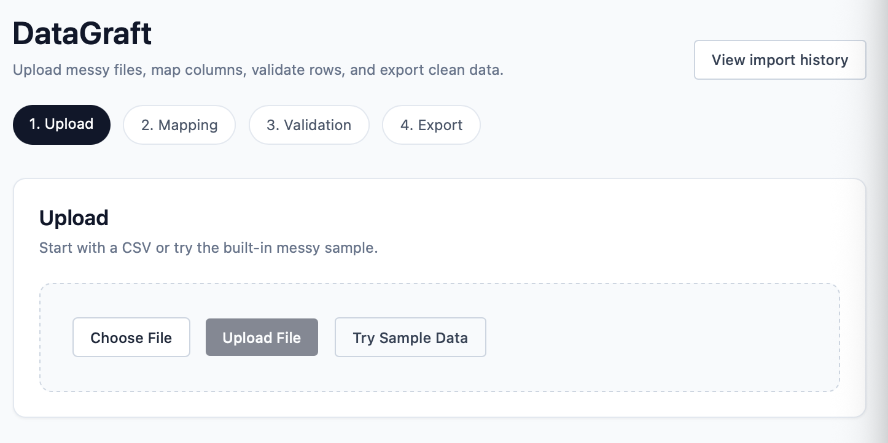
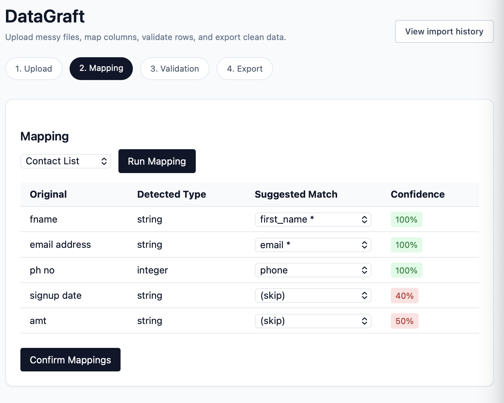
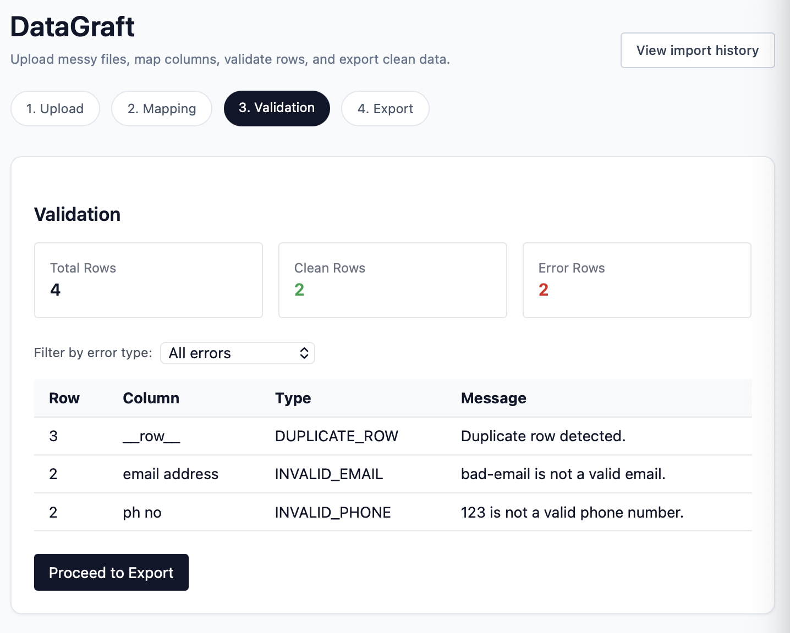
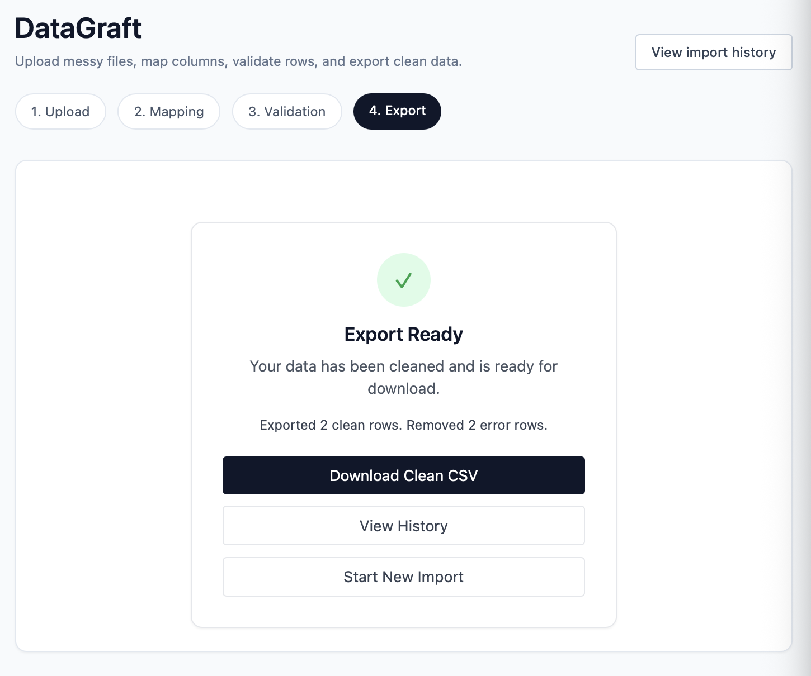
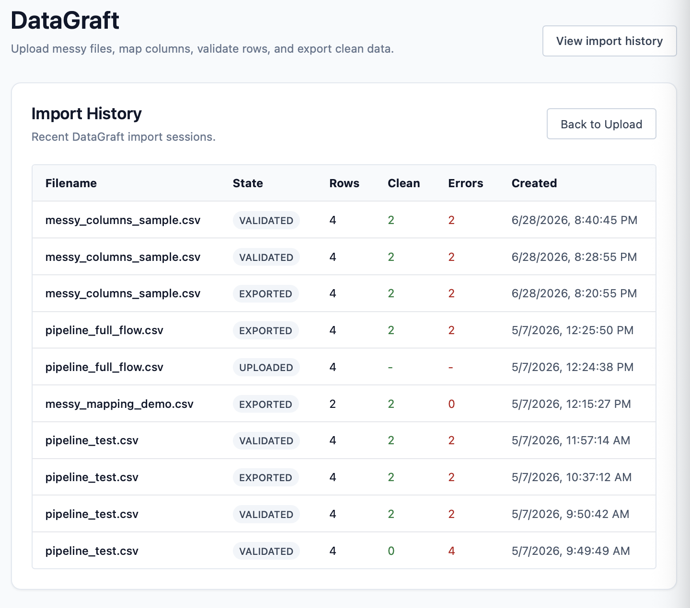
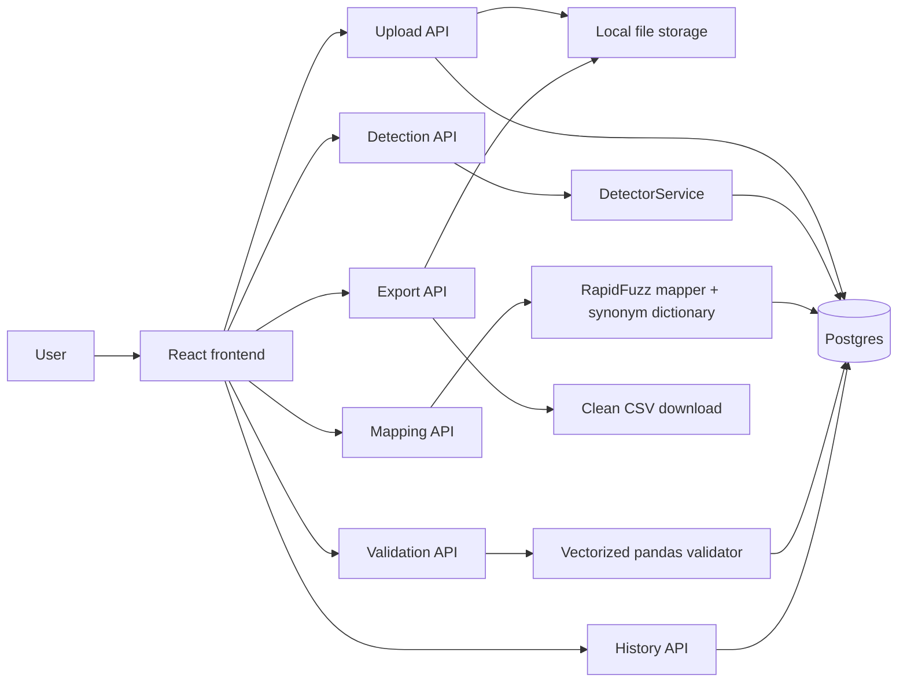

# DataGraft

Every data team has the same problem: someone hands you a CSV with columns named "fname", "EMAIL ADDRESS", and "Ph No.", half the emails are invalid, dates are in five different formats, and there are duplicate rows scattered throughout. You open it in Excel, spend two hours cleaning it, and do the same thing again next week.

DataGraft automates that workflow. Upload a messy CSV or Excel file, and the pipeline detects column types, fuzzy-matches source columns to a target schema, validates every row, and exports only the clean data — all enforced by a server-side state machine that prevents users from skipping steps and ensures export only includes rows that passed validation.

## Demo Flow

DataGraft follows a simple ingestion workflow: upload a messy file, map incoming columns to a target schema, validate dirty rows, and export a clean CSV.

### Upload



### Mapping



### Validation



### Export



### Import History



## Architecture



## How it works

The backend runs a six-stage pipeline: upload → detect → map → confirm → validate → export. Each stage advances the session state in PostgreSQL, and every API endpoint checks the current state before proceeding. You cannot call validation before mapping is confirmed. You cannot export before validation completes and the system has recorded which rows are clean.

The column mapper uses a built-in synonym dictionary combined with RapidFuzz token-sort matching. When you upload a file with a column named "fname", the mapper checks the synonym table first for an exact match to "first_name", then falls back to fuzzy scoring. Columns below the 60% confidence threshold are returned with no suggestion, forcing the user to manually assign them rather than silently mis-mapping.

The validator runs vectorized pandas operations across the full dataset — boolean masking for email regex, digit-length checks for phone numbers, `pd.to_datetime` with coerced errors for dates, and `pd.to_numeric` for numeric types. On a 100K-row, 5-column benchmark, validation dropped from roughly 12 seconds with a row loop to under 1 second after vectorization. Error indices are tracked separately from the capped error list so the export filter is always correct regardless of how many errors the UI displays.

The export endpoint writes the clean CSV response in 1,000-row chunks. For the current 10MB upload limit, this keeps response generation simple and predictable. For larger production files, export should move to chunked read/filter/write using persisted validation masks.

## Tech stack

FastAPI with async SQLAlchemy and PostgreSQL for the backend. Pandas for file parsing and vectorized validation. RapidFuzz for fuzzy column matching. React with Tailwind CSS for the frontend wizard. Docker Compose for local development. GitHub Actions CI running migrations and pytest against a live Postgres service.

## Run locally

Copy the example environment file and start the containers:
```bash
cp .env.example .env
docker compose up --build
```

The backend runs at `http://localhost:8000`. The frontend runs at `http://localhost:3000`. API docs are at `http://localhost:8000/docs`.

## Run tests

With the containers running:

docker compose exec backend alembic upgrade head
docker compose exec backend pytest

CI runs the backend tests against a Postgres 16 service container on every push.


## Architecture decisions

**PostgreSQL JSONB for pipeline metadata.** Detection results, mapping suggestions, confirmed mappings, and validation summaries are stored in a single JSONB column on the session row. This avoided schema migrations every time the pipeline output shape changed during development. The tradeoff is that JSONB is opaque to the query planner and the column grows linearly with error count. At scale, I would normalize into separate tables (column_detections, mapping_suggestions, validation_errors) with foreign keys to the session.

**Synchronous validation over Celery.** The vectorized validator processes 100K rows in under 3 seconds, so background job infrastructure is unnecessary overhead for this scope. If file sizes grew past 500K rows or validation rules became more complex (external API lookups, cross-column constraints), I would add Celery with Redis as the broker and return a polling endpoint for status.

**RapidFuzz over embeddings.** Fuzzy string matching with a synonym dictionary handles the common column-name variations (fname, first name, given name, f_name) without any API cost or model dependency. Embedding-based matching would help with semantic variations (e.g., "subscriber" → "email") but adds latency, cost, and a runtime dependency that isn't justified for the 90% case.

**Presets over dynamic schema builder.** The frontend uses preset target schemas (Contact List, Transaction Log) instead of letting users define custom schemas. This was a deliberate scope decision to keep the frontend simple while the backend API fully supports arbitrary schemas via the POST body.

## Production hardening (not implemented)

These are the changes I would make before running this in production:
- **File cleanup TTL.** Uploaded files persist indefinitely. A cron job or background task should delete files older than 24 hours from the upload directory.
- **Authentication and rate limiting.** The upload endpoint currently accepts anonymous requests with no throttling. Production would need API key auth or session-based auth with per-user rate limits.
- **JSONB normalization.** For datasets with tens of thousands of errors, the validation results should be stored in a separate table rather than a single JSONB cell.
- **Transaction isolation on state transitions.** Concurrent requests to the same session can race on state checks. Production would need SELECT FOR UPDATE or an optimistic concurrency control pattern.
- **Input sanitization on error messages.** Raw cell values are currently embedded in validation error messages. These should be escaped or truncated before being rendered in the frontend.
- **Streaming export at larger scale.** Export currently streams the response body in chunks, but still works from a parsed DataFrame. For much larger files, export should read and filter the source file in chunks using persisted validation masks.